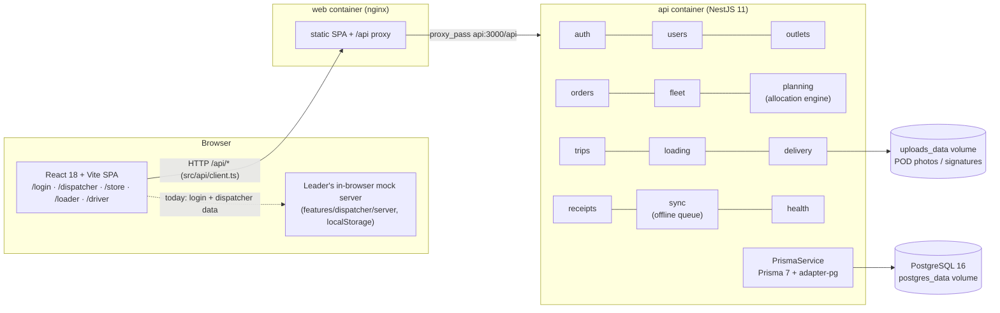

# Architecture

Waypoint is a modular monolith in three tiers: a single responsive React web app, a NestJS REST API, and
PostgreSQL. Everything runs with `docker compose up`.

## Web app (`apps/web`)

- `src/app/App.tsx` wraps everything in the shared session (`AuthProvider`) and renders either the Login
  screen or exactly one role module, chosen by the signed-in role (`src/app/routes.ts`).
- Each role module is a Designathon prototype copied verbatim into `src/features/<role>/` and keeps its own
  `BrowserRouter`, mounted with `basename` = the role's base path.
- Sessions are per browser tab (`sessionStorage`), so judges can sign in as a different role in each tab.

## Current data path and the swap seam

- **Today:** login and the Dispatcher module use the team leader's in-browser mock server
  (`features/dispatcher/server/*`, persisted in `localStorage`). Store Manager, Loader and Driver modules
  use their own in-memory mock contexts. Roles therefore do not yet share live data.
- **Next:** module owners implement the NestJS endpoints and replace the mock calls:
  - Dispatcher / login: `features/dispatcher/utils/network.ts` → `transport()` is the single function to
    point at the API via `src/api/client.ts` (`apiFetch`).
  - Store / Loader / Driver: replace the mock contexts (`OrdersContext`, `LoaderContext`, `DriverContext`)
    with calls through `apiFetch`.

## API (`apps/api`)

- Global prefix `/api`; `GET /api/health` returns `200 {status:"ok",db:"up"}` or `503 {status:"degraded",db:"down"}`.
- One Nest module per starter-pack area; each has an empty controller/service for its owner to fill.
- Controllers stay thin; business rules (allocation, status transitions, cutoff, sync idempotency) belong in
  services so they can be unit-tested.

## Startup sequence (`docker compose up`)

1. `db` starts and passes `pg_isready`.
2. `api` runs `prisma migrate deploy`, then the idempotent seed, then starts NestJS on :3000.
3. `api` passes its `/api/health` check; `web` (nginx) starts on :8080 and proxies `/api/` to `api:3000`.
