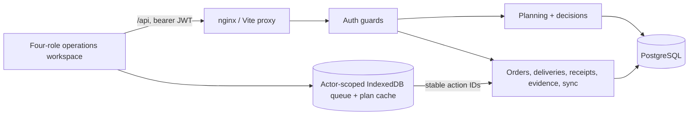

# Architecture

Waypoint is a modular monolith: React/Vite, NestJS REST and PostgreSQL/Prisma.

`src/app/App.tsx` mounts the common API-backed `features/operations` workspace for the authenticated role.
Sessions are per tab; each API request rechecks the active database account and permissions. The old
Designathon role modules and their mock transports remain design references and are not mounted.

`PlanningModule` owns draft/validate/allocate/publish, amendments, Loader checks, shortfall decisions,
recovery, deferrals and rescheduling. `WorkflowModule` provides the connected Store/Driver/receipt/evidence
endpoints pending owner-module refactoring. Avoid duplicate route registration during that handoff.

Mutations use a shared actor/action ledger inside serializable PostgreSQL transactions. The ledger
stores the original response together with the business writes. Changed payloads cannot reuse a key.
Stale field facts commit to FieldConflict without changing the newer plan; Dispatcher resolution is
versioned and audited. Images are authenticated, scoped PostgreSQL bytes, limited to 10 MiB each.
The uploads volume remains reserved for a future storage adapter and is not the active evidence store.

The Driver outbox commits action and Blob data to IndexedDB before acknowledging save. It uploads
images with stable per-attachment action IDs, then syncs the immutable field request. Conflicts and
failures retain evidence. Web Locks serialize tabs; server idempotency remains authoritative. The
production service worker caches only the public app shell; authenticated API responses never enter
CacheStorage. A cached session supports offline capture, but departure requires an online API check.

Docker starts PostgreSQL, deploys migrations, seeds demo accounts, then starts NestJS and nginx.
The optional planning-demo seed supplies explicitly fictional catalog/calendar/travel data. Official
reference data is a separate import. See [team integration and verification](team-integration.md) for
commands, endpoint handoffs, tested scenarios and current UI limits.
