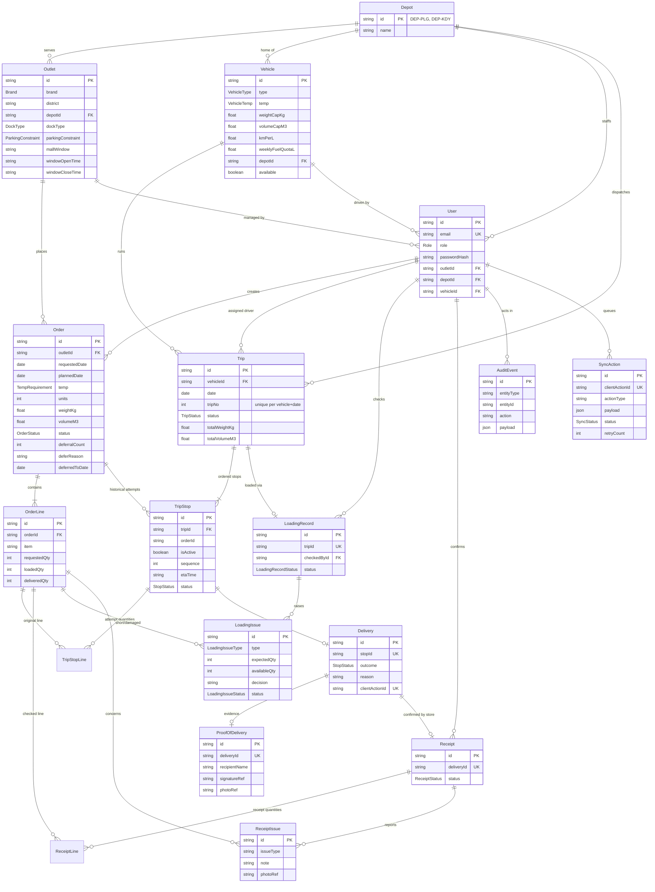

# Data model

## Demo allocation fixtures

The idempotent seed supplies four outlets, five vehicles and five allocation orders with prototype
IDs. New orders have requested/planned date **2026-10-05**, status `CONFIRMED`, and the persisted
dispatcher account as creator (resolved by email). All fixture upserts are insert-only (`update: {}`): reruns preserve existing reference data,
credentials, original requested quantities, dates, statuses, allocations and completed operational values.

| Order | Candidate / expected case |
|---|---|
| `ORD-DEMO-CHILLED` | `TRK-021`: feasible; `TRK-041`: wrong depot; `TRK-030`: incompatible temperature |
| `ORD-DEMO-AMBIENT` | `TRK-030`: feasible; `TRK-024`: unavailable |
| `ORD-DEMO-VAN` | `VAN-012`: feasible; `TRK-021`: van-only access rejection |
| `ORD-DEMO-WEIGHT` | `TRK-021`: 1001 kg exceeds 1000 kg; volume fits |
| `ORD-DEMO-VOLUME` | `TRK-021`: 18.1 m³ exceeds 18 m³; weight fits |

`OUT-005` supplies Peliyagoda van-only access; `OUT-014` supplies Kandy reference coverage.
`OUT-005` uses demo `STREET` dock semantics, not an official mapping of the mock's rear lane.
Fixtures cover first-pass suitability/capacity without calendar, frozen goods or route estimates.

Source of truth: [`apps/api/prisma/schema.prisma`](../apps/api/prisma/schema.prisma) (draft; owners refine
fields through migrations). Initial migration: `apps/api/prisma/migrations/0001_init` (immutable). The additive contract migration is
`20261004120000_workflow_contract_v1`.

## Key rules encoded in the schema

| Rule | Where |
|---|---|
| A vehicle runs at most two numbered trips per day | `Trip @@unique([vehicleId, date, tripNo])`; the 2-trip cap itself is enforced by the planning service |
| An order is on at most one active stop | PostgreSQL partial unique index `TripStop_one_active_order_key` on `orderId WHERE isActive = true` |
| Stop sequence is unique within a trip | `TripStop @@unique([tripId, sequence])` |
| Offline actions are idempotent | `SyncAction.clientActionId @unique`, `Delivery.clientActionId @unique` |
| Failed outcome is kept; recovery is recorded separately | `Delivery.outcome` + `AuditEvent` history |
| Evidence is stored as references, not browser preview URLs | `ProofOfDelivery.signatureRef/photoRef`, `ReceiptIssue.photoRef` |

## Status enums

- `OrderStatus`: CONFIRMED → PLANNED → LOADING → READY → IN_TRANSIT → DELIVERED → RECEIVED, or DEFERRED
- `TripStatus`: DRAFT → CONFIRMED → LOADING → READY → IN_TRANSIT → COMPLETED / COMPLETED_WITH_EXCEPTIONS
- `StopStatus`: PLANNED → ARRIVED → DELIVERED / PARTIAL / FAILED / RESCHEDULED
- `LoadingIssueStatus`: OPEN → REPLACEMENT_LOADED / SHIP_SHORT / RESOLVED
- `SyncStatus`: PENDING_SYNC → SYNCING → SYNCED / CONFLICT / FAILED
- `ReceiptStatus`: PENDING → CONFIRMED / CONFIRMED_WITH_ISSUE

## Workflow contract v1

- **Brand:** derive `Order -> Outlet.brand`; there is no authoritative `Order.brand` or client brand.
- **Attempts:** `Order.stops` contains all historical `TripStop` rows. `isActive` marks the current
  assignment. Release it and create the next stop in one transaction; retain old stop, delivery and POD.
  A dispatcher REDELIVER/reschedule decision belongs in `AuditEvent` with actor, reason, old/new date,
  and prior/new stop references. A failed or partial outcome is never overwritten by recovery.
- **Uniqueness:** the migration manually creates the PostgreSQL partial unique index for one active
  stop per order. It is intentionally not a lifetime `@unique` on `orderId`. Preserve this index in
  future generated migrations and test it after database recreation; `db push` alone is insufficient.
- **Quantities:** `TripStopLine` is authoritative for an attempt: `plannedQty`, `cancelledQty`,
  `loadedQty`, `deliveredQty`, `returnedQty`, unique by `(tripStopId, orderLineId)`. Loaded/delivered
  remain null until recorded. `OrderLine.requestedQty` is original demand and never changes for retry.
  Existing `OrderLine.loadedQty/deliveredQty` are compatibility fields, not attempt history.
- **Receipts:** `ReceiptLine` stores `acceptedQty`, `damagedQty`, `missingQty`, unique by
  `(receiptId, orderLineId)`. The owner must validate transactionally that these nonnegative quantities
  sum to the matching `TripStopLine.deliveredQty` for `Receipt -> Delivery -> TripStop`.
  Line/order membership must also be checked; ordinary foreign keys alone do not enforce it.
- **Driver:** `Trip.driverId` references the existing User, independently of later vehicle/user
  reassignment. It is nullable for legacy rows/unassigned drafts; assign a DRIVER before publishing.
  Independent driver scheduling is outside v1.
- **Calendar:** `OperatingDay.date` is a unique PostgreSQL DATE with an `operating` boolean.
  It is global: no depot scope. Demo rows are not an official calendar; missing-date policy and
  the official calendar horizon must be agreed before production planning.
- **History deletion:** TripStop/LoadingRecord prevent deletion of their trip; POD prevents deletion
  of its delivery. Attempt and receipt lines restrict parent deletion. Recovery creates records rather
  than deleting/replacing original attempts. Explicit destructive cleanup is outside normal workflows.
- **Upgrade:** terminal legacy stops are marked inactive. Existing OrderLine counts are copied to
  their single baseline attempt; unknown values remain null. Legacy trip drivers remain unassigned;
  existing receipts are not assigned invented quantities and require explicit reconciliation.
- **Business rules:** maximum two trips/day, valid receipt sums, quantity bounds and matching lines
  are transactional owner rules, not implied by uniqueness constraints.

### Shared workflow fixtures

| IDs | Purpose |
|---|---|
| `LINE-ORD-DEMO-*` | One deterministic cases line for each existing allocation order |
| `ORD-WF-HAPPY`, `LINE-WF-HAPPY` | Ten chilled cases, received at OUT-001 on 2026-10-05 |
| `TRIP-WF-HAPPY`, `STOP-WF-HAPPY`, `ATTEMPT-WF-HAPPY` | Completed TRK-021 trip, inactive delivered stop, 10 planned/loaded/delivered |
| `LOAD-WF-HAPPY` | Completed loading record for the happy trip |
| `DELIVERY-WF-HAPPY`, `POD-WF-HAPPY` | Full delivery and capture metadata; demo asset references are placeholders |
| `RECEIPT-WF-HAPPY`, `RECEIPT-LINE-WF-HAPPY` | Store confirmation: accepted 10, damaged 0, missing 0 |
| `ORD-WF-SHORT`, `LINE-WF-SHORT` | Ten requested chilled cases; eight currently loaded |
| `TRIP-WF-PLANNED`, `STOP-WF-SHORT`, `ATTEMPT-WF-SHORT` | Scheduled 2026-10-06 trip in LOADING, active stop, no delivery yet |
| `LOAD-WF-SHORT`, `ISSUE-WF-SHORT` | In-progress loading and OPEN missing-two issue; not ready to depart |
| `ORD-WF-DEFERRED`, `LINE-WF-DEFERRED`, `AUDIT-WF-DEFERRED` | Five ambient cases deferred from 2026-10-05 to 2026-10-06 for capacity |
| `SYNC-WF-HAPPY`, `ACTION-WF-DELIVER-HAPPY` | Synced delivery action with a stable idempotency key shared by Delivery |
| `2026-10-05`, `2026-10-06`, `2026-10-11` | Global operating, operating, and closed dates |

All workflow records use insert-only upserts so reruns cannot reset completed quantities/statuses.
The happy trip consumes TRK-021 trip number 1 on 2026-10-05; allocation tests must account for it.
