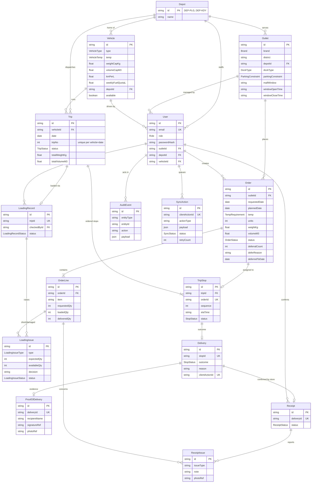

# Data model

## Demo allocation fixtures

The idempotent seed supplies four outlets, five vehicles and five allocation orders with prototype
IDs. New orders have requested/planned date **2026-10-05**, status `CONFIRMED`, and the persisted
dispatcher account as creator (resolved by email). Reruns update fixture loads but preserve order
dates/status and allocations; use fresh fixtures for independent tests.

| Order | Candidate / expected case |
|---|---|
| `ORD-DEMO-CHILLED` | `TRK-021`: feasible; `TRK-041`: wrong depot; `TRK-030`: incompatible temperature |
| `ORD-DEMO-AMBIENT` | `TRK-030`: feasible; `TRK-024`: unavailable |
| `ORD-DEMO-VAN` | `VAN-012`: feasible; `TRK-021`: van-only access rejection |
| `ORD-DEMO-WEIGHT` | `TRK-021`: 1001 kg exceeds 1000 kg; volume fits |
| `ORD-DEMO-VOLUME` | `TRK-021`: 18.1 m³ exceeds 18 m³; weight fits |

`OUT-005` supplies Peliyagoda van-only access; `OUT-014` supplies Kandy reference coverage.
`OUT-005` uses demo `STREET` dock semantics, not an official mapping of the mock's rear lane.
Fixtures cover first-pass suitability/capacity without calendar, frozen goods or route estimates.

Source of truth: [`apps/api/prisma/schema.prisma`](../apps/api/prisma/schema.prisma) (draft; owners refine
fields through migrations). Initial migration: `apps/api/prisma/migrations/0001_init`.

## Key rules encoded in the schema

| Rule | Where |
|---|---|
| A vehicle runs at most two numbered trips per day | `Trip @@unique([vehicleId, date, tripNo])`; the 2-trip cap itself is enforced by the planning service |
| An order is on at most one active stop | `TripStop.orderId @unique` |
| Stop sequence is unique within a trip | `TripStop @@unique([tripId, sequence])` |
| Offline actions are idempotent | `SyncAction.clientActionId @unique`, `Delivery.clientActionId @unique` |
| Failed outcome is kept; recovery is recorded separately | `Delivery.outcome` + `AuditEvent` history |
| Evidence is stored as references, not browser preview URLs | `ProofOfDelivery.signatureRef/photoRef`, `ReceiptIssue.photoRef` |

## Status enums

- `OrderStatus`: CONFIRMED → PLANNED → LOADING → READY → IN_TRANSIT → DELIVERED → RECEIVED, or DEFERRED
- `TripStatus`: DRAFT → CONFIRMED → LOADING → READY → IN_TRANSIT → COMPLETED / COMPLETED_WITH_EXCEPTIONS
- `StopStatus`: PLANNED → ARRIVED → DELIVERED / PARTIAL / FAILED / RESCHEDULED
- `LoadingIssueStatus`: OPEN → REPLACEMENT_LOADED / SHIP_SHORT / RESOLVED
- `SyncStatus`: PENDING_SYNC → SYNCING → SYNCED / CONFLICT / FAILED
- `ReceiptStatus`: PENDING → CONFIRMED / CONFIRMED_WITH_ISSUE
