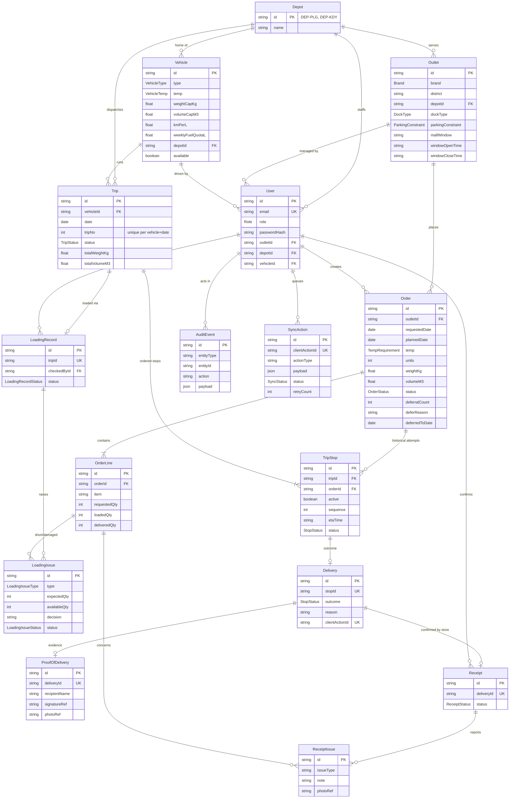

# Data model

> Integration update: the real four-role workspace and connected Order/Delivery/Receipt/Sync APIs are now implemented. See [team integration and verification](team-integration.md) for current setup, migrations and test evidence; older handoff notes below describe the earlier phase.

The [API and workflow contract v1](api-contract-v1.md) records the agreed cancellation, delivery-attempt,
plan-version and sync behavior. Migration `0002_planning_contract` adds the planning and quantity-history foundation;
`0003_decisions_and_rescheduling` adds the decision/acknowledgement stamps, pending quantities and deferral history.
See [planning implementation status](planning-backend.md) for the implemented mappings and remaining owner work.

Source of truth: [`apps/api/prisma/schema.prisma`](../apps/api/prisma/schema.prisma) (draft; owners refine
fields through migrations). Initial migration: `apps/api/prisma/migrations/0001_init`.

## Key rules encoded in the schema

| Rule | Where |
|---|---|
| A vehicle runs at most two numbered trips per day | Partial unique index on unreleased `(vehicleId, date, tripNo)`, SQL slot check 1/2, and planning validation |
| An order is on at most one active stop | Partial unique index on `TripStop.orderId WHERE active` |
| Stop sequence is unique within a trip | `TripStop @@unique([tripId, sequence])` |
| Offline actions are idempotent | Actor-scoped `MutationRecord` with payload hash/result; field sync preserves stale-plan conflicts |
| Failed outcome is kept; recovery is recorded separately | `Delivery.outcome`, `RecoveryDecision`, per-attempt `TripStopLine` and audit history |
| Evidence is stored as references, not browser preview URLs | `ProofOfDelivery.signatureRef/photoRef`, `ReceiptIssue.photoRef` |

## Status enums

- `OrderStatus`: CONFIRMED → PLANNED → LOADING → READY → IN_TRANSIT → DELIVERED → RECEIVED, or DEFERRED
- `TripStatus`: DRAFT → CONFIRMED → LOADING → READY → IN_TRANSIT → COMPLETED / COMPLETED_WITH_EXCEPTIONS
- `StopStatus`: PLANNED → ARRIVED → DELIVERED / PARTIAL / FAILED / RESCHEDULED
- `LoadingIssueStatus`: OPEN → REPLACEMENT_LOADED / SHIP_SHORT / RESOLVED
- `SyncStatus`: PENDING_SYNC → SYNCING → SYNCED / CONFLICT / FAILED
- `ReceiptStatus`: PENDING → CONFIRMED / CONFIRMED_WITH_ISSUE

## DB seed / importer reconciliation (PR #5)

The main schema and migrations `0001`–`0004` are authoritative. The unmerged
`20261004120000_workflow_contract_v1` migration was removed because it repeated tables/index changes
already implemented in `0002` and used incompatible names. Current fields are `TripStop.active` and
`TripStopLine.stopId`; quantity uniqueness is `(stopId, orderLineId)`. No new schema migration is needed.
If a separate database already applied the old branch-only migration, reconcile its migration history
and data explicitly before upgrading; these tests cover fresh databases and the main migration chain.

The insert-only seed preserves existing operator data on rerun. It adds these fictional fixtures:

| Fixture | Current contract |
|---|---|
| `ORD-WF-HAPPY` / `TRIP-WF-HAPPY` | Completed published trip on 2026-10-05, inactive stop, ten loaded/delivered/accepted cases, departure and fuel snapshots |
| `DELIVERY-WF-HAPPY` | Immutable recorded outcome/capture time, receipt lines, authenticated synthetic PNG evidence (not a real signature) |
| `ORD-WF-SHORT` / `TRIP-WF-PLANNED` | Published loading trip on 2026-10-06, eight of ten cases loaded, unresolved issue with stop/plan references; readiness remains blocked |
| `ORD-WF-DEFERRED` | Five cases deferred with both `OrderDeferral` history and audit event |
| `OUT-005` | Fictional STYLE delivery weekday Monday (`scheduledWeekday = 1`) |

Reference travel/handling entries are explicitly fictional and insert-only. For future-date planning,
run the existing `db:seed:planning-demo` helper. Official imports remain separate from demo startup;
see [dataset importer](dataset-import.md). The seed does not backfill previously created incomplete
workflow records or overwrite live progress.

Validation commands: `npm run typecheck:prisma -w apps/api`, `npm test`, `npm run build`, and
`TEST_DATABASE_URL=... npm run test:seed -w apps/api`. The last command creates/drops a uniquely named
test database, deploys actual migrations, seeds twice, checks real API reads/Loader gates and runs the
actual importer CLI in dry-run/apply/replay modes. Its database user needs CREATE DATABASE permission.
